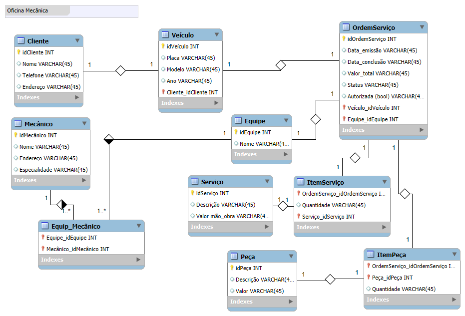

# 🔧 Oficina Mecânica – Esquema Conceitual de Banco de Dados

Este projeto foi desenvolvido como parte do desafio da plataforma DIO, no curso de Análise de Dados com Power BI, com o objetivo de criar um **esquema conceitual do zero**, baseado na narrativa de um sistema de gerenciamento de ordens de serviço em uma oficina mecânica.

---

## 📌 Objetivo

Modelar o banco de dados de um sistema responsável por controlar a execução e o acompanhamento de ordens de serviço, com foco na rastreabilidade de clientes, veículos, equipes de mecânicos, serviços prestados e peças utilizadas.

---

## 🧩 Regras de Negócio

A modelagem foi baseada na seguinte narrativa:

- Clientes levam veículos à oficina para manutenção ou revisão.
- Cada veículo é atribuído a uma equipe de mecânicos, responsável por identificar os serviços necessários e preencher a ordem de serviço (OS).
- A OS registra:
  - Data de emissão e conclusão
  - Status atual
  - Autorização do cliente
  - Valor total dos serviços e peças
- Os valores dos serviços são baseados em uma tabela de referência de mão de obra.
- Peças utilizadas também são incluídas na OS, com seus respectivos valores.
- Uma mesma equipe avalia e executa os serviços.
- Mecânicos possuem: código, nome, endereço e especialidade.

---

## 🧱 Estrutura do Modelo Conceitual

### Principais Entidades:

- **Cliente**: Informações do cliente que leva veículos à oficina.
- **Veículo**: Associado a um cliente.
- **Mecânico**: Com dados pessoais e especialidade.
- **Equipe**: Agrupamento de mecânicos.
- **Ordem de Serviço (OS)**: Documento que detalha os serviços e peças a serem executados.
- **Serviço**: Tipos de serviços oferecidos com valores de mão de obra.
- **Peça**: Peças utilizadas na execução dos serviços.

### Relacionamentos:

- Um cliente pode possuir vários veículos.
- Cada OS é vinculada a um veículo e a uma equipe.
- Uma equipe pode conter vários mecânicos e um mecânico pode pertencer a várias equipes (relacionamento N:N).
- Uma OS pode conter vários serviços e várias peças (relacionamentos N:N com tabelas associativas).
- Cada serviço e peça possui uma quantidade e valor correspondente.

---

## 🖼 Diagrama do Modelo

Abaixo está o diagrama entidade-relacionamento (EER) criado com o **MySQL Workbench**:

> 📌 *O arquivo da imagem está incluído no repositório com o nome `oficina-mecanica-diagrama.png`.*

---

## 📌 Observações Técnicas

- Os tipos de dados foram definidos com base em boas práticas (ex: `DATE` para datas, `DECIMAL` para valores monetários, `BOOLEAN` para autorização).
- Nomeação dos atributos foi padronizada para facilitar leitura e integração com outras ferramentas como Power BI.
- O modelo foi construído usando o **MySQL Workbench**.

---

## ✅ Conclusão

Este projeto demonstra o processo de construção de um esquema conceitual completo para um sistema real, com base em requisitos textuais. O objetivo foi representar de forma clara e organizada os dados necessários para o funcionamento da oficina mecânica, respeitando as boas práticas de modelagem relacional.
